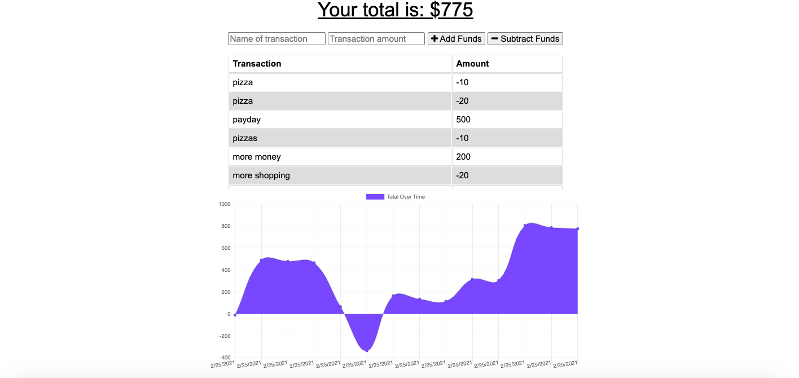

# Budget Tracker

  ## Description

a Progress Web App with offline functionality that allows you track both positive and negative transactions using a No-SQL database.
  
To view the deployed application, [Click Here](https://quiet-crag-50208.herokuapp.com/)
  
  ## Table of Contents
  
  * [Installation](#installation)
  * [Usage](#usage)
  * [Contributing](#contributing)
  * [Testing](#testing)
  * [License](#license)
  * [Questions](#questions)
  
  ## Installation

  If running application on your local device, you will need Node.js to run this program.  After cloning the code to your local device, be sure to run `node npm install` to include essential npm packages.  You can then run `npm start` to activate the server and view the application on your local host at "http://localhost:3001/"
  
  ## Usage 
  To create transactions, first give the transaction a name, dollar amount, and whether it is subtracting or adding money to your account.  After submitting your transactions, your total balance at the top of the page and the graph at the bottom of the page will automatically update to show your spending trend.
  
  To deploy the app as a PWA desktop, you can click the download icon to the right of the url in your broswer.
  
  ## Contributing

 Please reach out via email if you wish to contribute (see questions section below)
  
  ## Testing

  No testing currently.
  
  ## License

  
  
  ## Questions
  
  * GitHub: [@fancibleunicorn](https://github.com/fancibleunicorn)
  * Email: adamcrandall91@gmail.com
